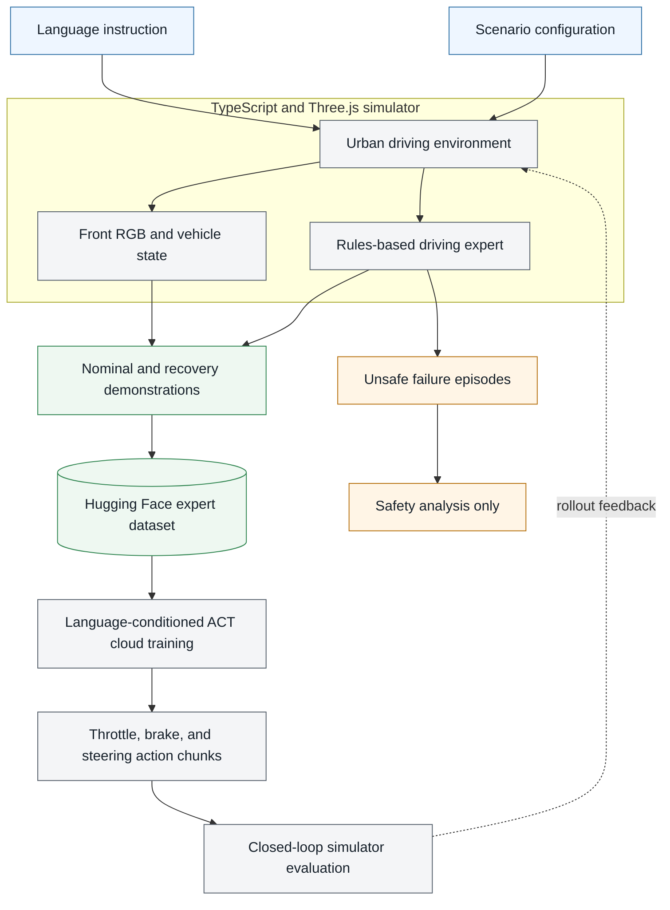

# Action Chunking Transformer for Autonomous Driving

An end-to-end research project for language-conditioned autonomous driving. The repository contains the browser simulator, automated expert, dataset collector, recovery scenarios, and Python code for training an Action Chunking Transformer on RunPod or Modal.


## Current status

| Part | Status |
| --- | --- |
| TypeScript driving simulator | Working |
| Automated expert and recovery controller | Working |
| Dataset collection and validation | Complete |
| Hugging Face dataset | Published |
| Language-conditioned ACT training code | Ready and tested |
| RunPod/Modal GPU training | Not started |
| Trained checkpoint | Not available yet |
| Closed-loop learned-policy evaluation | Pending |

The status matters. This repository has a complete training path, but it does not claim that a learned policy can drive successfully yet. That claim has to wait for a real training run and closed-loop simulator evaluation.

## Project flow



The simulator and policy code live together so the data contract is visible from both sides. Camera resolution, state order, action order, frame rate, instructions, and split assignments are documented rather than hidden in separate projects.

## Driving simulator

The simulator uses **Vite, TypeScript, and Three.js**. It is not a Next.js application.

It provides:

- a 3D urban road environment with traffic and pedestrians
- a front-camera model view for policy observations
- deterministic world and traffic seeds
- clear, rain, and fog conditions
- low, medium, and high traffic density
- live speed, steering, route progress, collision, and off-route telemetry
- training and inference interface modes
- continuous controls for throttle, brake, and steering

### Language-conditioned scenarios

The current scenario set covers:

- left, right, and straight intersection routes
- traffic-light compliance
- pedestrian stopping
- passing a slow vehicle
- yielding to a cut-in vehicle
- following a curved road
- taking a detour around a blocked lane

Roundabouts are intentionally absent from this version.

### Run the simulator

Requirements:

- Node.js 22 or newer
- a current Chrome or Chromium browser

```bash
git clone https://github.com/Mayankpratapsingh022/Action_Chunking_Transformer_Autonomous_Driving.git
cd Action_Chunking_Transformer_Autonomous_Driving
npm install
npm run dev
```

Open the local URL printed by Vite, normally `http://localhost:5173`.

## Expert driving and recovery

The automated expert is a rules-based controller, not a trained model. It follows the route, tracks the lane, manages speed, responds to scenario actors, and produces continuous expert actions.

Driving variation comes from scenario seeds, traffic seeds, weather, traffic density, route variants, instruction paraphrases, and cautious, normal, or assertive expert profiles.

Recovery episodes begin from controlled disturbances such as:

- lateral position offsets
- heading errors
- overspeed
- stalled starts

The target remains safe expert behavior: return to the route and continue the instruction. Deliberately unsafe episodes are stored separately for analysis and are never used as imitation targets.

## Dataset

The completed dataset is published at [`Mayank022/urban-vla-expert-v1`](https://huggingface.co/datasets/Mayank022/urban-vla-expert-v1).

Dataset composition:

| Category | Episodes | Use |
| --- | ---: | --- |
| Nominal expert | 900 | Behavior cloning |
| Expert recovery | 180 | Behavior cloning |
| Unsafe failure analysis | 90 | Analysis only |

The 1,080 expert episodes use this fixed split:

| Split | Episodes | Frames | Hours | Use |
| --- | ---: | ---: | ---: | --- |
| Train | 756 | 224,133 | 6.23 | Optimization |
| Validation | 162 | 47,614 | 1.32 | Model selection |
| Test | 162 | 47,933 | 1.33 | Final open-loop evaluation |

Each expert frame contains:

```text
front image:  256 x 256 RGB at 10 Hz
state:        [speed_mps, steering, previous_throttle, previous_brake]
instruction:  natural-language driving command
action:       [throttle, brake, steering]
```

Download the full dataset without adding its large videos to Git:

```bash
hf download Mayank022/urban-vla-expert-v1 \
  --repo-type dataset \
  --local-dir datasets/urban-vla-expert-v1
```

See [DATASET_COLLECTION.md](DATASET_COLLECTION.md) for collection, background execution, resume, validation, and folder details.

## Action Chunking Transformer

The policy is a **language-conditioned Action Chunking Transformer (ACT)**. It predicts 20 future controls from one observation, which corresponds to a two-second plan at 10 Hz.

### Inputs

- current `128 x 128` front-camera tensor, resized from the stored `256 x 256` video
- four-dimensional vehicle state
- natural-language route instruction

### Deep-learning architecture

```text
camera ------> pretrained ResNet-18 ------> 16 spatial vision tokens
state  ------> state MLP -----------------> state token
language ----> frozen MiniLM -------------> language token
actions -----> CVAE posterior ------------> latent token during training

all context tokens --> Transformer encoder
20 action queries  --> Transformer decoder --> [throttle, brake, steering] x 20
```

The action transformer and CVAE learn from the driving dataset. ResNet-18 is fine-tuned at a smaller learning rate, while MiniLM is frozen by default. This is a practical setup for a dataset with fewer than nine hours of expert driving; it does not pretend to pretrain vision and language from scratch.

The source videos remain at `256 x 256`. PyAV resizes frames to `128 x 128` while decoding, so there is no separate converted dataset and no additional copy stored on disk.

The objective is:

```text
loss = masked action L1 + beta * latent KL divergence
```

Padded actions at episode boundaries are excluded by a mask. During inference the CVAE latent is set to zero, making the predicted chunk deterministic for the same observation and instruction.

The full architecture, training defaults, artifact format, metrics, and inference API are documented in the [ACT training guide](act_training/README.md).

## Train on RunPod

The simplest RunPod workflow is manual: create an H100 or RTX PRO 6000 Pod in the dashboard, clone this repository under `/workspace`, and run one Python entrypoint:

```bash
cd /workspace/Action_Chunking_Transformer_Autonomous_Driving/act_training
python3 runpod_main.py --dry-run
python3 runpod_main.py --run-name act-driving-v1 --max-steps 10000 --batch-size 64
```

`runpod_main.py` installs the remaining dependencies, validates CUDA, uses persistent `/workspace` paths, resumes checkpoints, streams logs, evaluates the best model, and pushes the completed artifact set to Hugging Face. The detailed manual setup is in the [ACT training guide](act_training/README.md#manual-runpod-training).

The optional RunPod launcher creates an on-demand H100 Pod through the REST API. It clones this repository, trains from the published Hugging Face dataset, stores resumable checkpoints on a network volume, and publishes the completed model and plots to Hugging Face. It requires `--yes` before creating billable compute.

Before launching, commit and push the RunPod files because the remote Pod clones the configured Git branch. Then configure `act_training/.env` with `RUNPOD_API_KEY` and `RUNPOD_NETWORK_VOLUME_ID`, and create a RunPod secret named `huggingface_token` containing the Hugging Face write token.

```bash
cd act_training

python3 runpod_launcher.py launch --dry-run
python3 runpod_launcher.py launch --yes

python3 runpod_launcher.py watch
python3 runpod_launcher.py logs
```

The lifecycle watcher reports Pod allocation and exit state. The RunPod dashboard shows the full training stream, including step, percent, loss, elapsed time, ETA, and validation metrics. After the Pod reaches `EXITED`, remove its Pod record without deleting the network volume:

```bash
python3 runpod_launcher.py terminate --yes
```

The full API-key, secret, network-volume, resume, monitoring, and artifact-download workflow is in the [ACT training guide](act_training/README.md).

## Train on Modal

No Modal job has been launched from this repository. These commands are for the future training run.

The default H100 profile uses BF16, fused AdamW, a batch size of 64, and 10,000 optimizer steps. That keeps the training budget at 640,000 samples.

```bash
cd act_training
python3 -m venv .venv
source .venv/bin/activate
python -m pip install -r requirements-local.txt

hf auth login
modal setup

test -f .env || cp .env.example .env
# Edit .env and set HF_TOKEN.

./scripts/start_h100_tmux.sh
```

Monitor the run from another terminal:

```bash
modal app logs urban-vla-language-act-training
```

Training checkpoints are committed to a persistent Modal Volume every 500 steps. Re-running with the same name loads `last.pt` and continues. When training completes, the entrypoint downloads the artifacts locally and publishes the checkpoint, tokenizer, metrics, and plots to Hugging Face.

## Evaluation

The Python trainer measures held-out action imitation with:

- throttle, brake, and steering MAE and RMSE
- steering-direction accuracy
- braking classification accuracy
- simultaneous throttle-and-brake rate
- per-intent action MAE

These are open-loop metrics. They compare predicted controls with recorded expert controls, but a small error does not guarantee stable driving.

A trained checkpoint still needs closed-loop evaluation for route completion, collisions, off-road time, traffic-light violations, pedestrian violations, recovery success, and control smoothness. The TypeScript inference client and the Python ACT artifact currently use different action interfaces, so a continuous-control serving adapter must be completed before that evaluation.

## Repository structure

```text
.
|-- src/
|   |-- world/                 # Road graph and city construction
|   |-- entities/              # Ego vehicle and traffic
|   |-- collection/            # Recovery and collection protocol
|   |-- vla/                   # Expert, recorder, video, inference client
|   |-- visual/                # Vehicle and render-quality layers
|   `-- ui/                    # Simulator HUD
|-- scripts/                   # Collection, validation, audit, conversion
|-- datasets/                  # Manifests and local dataset workspace
|-- act_training/
|   |-- src/urban_act/         # Python ACT package
|   |-- configs/               # Training defaults
|   |-- tests/                 # CPU unit tests
|   |-- runpod_main.py         # Manual one-command RunPod trainer
|   |-- runpod_train.py        # Standalone RunPod trainer
|   |-- runpod_launcher.py     # RunPod REST lifecycle client
|   `-- modal_app.py           # Modal H100 entrypoint
|-- docs/images/               # Tracked documentation media
|-- DATASET_COLLECTION.md
|-- package.json
`-- README.md
```

Large raw episodes, generated artifacts, caches, and secrets are excluded from Git.

## Verification

Simulator checks:

```bash
npm run check
npm run smoke
npm run audit
```

Dataset validation:

```bash
npm run dataset:validate
```

ACT package checks, without a GPU or training run:

```bash
cd act_training
python -m compileall modal_app.py runpod_launcher.py runpod_main.py runpod_train.py src tests scripts
python -m pytest
```

The ACT unit tests cover configuration validation, dataset split handling, failure-data exclusion, bounded actions, deterministic inference, masked loss, and gradient flow.

## Limits and safety

This is a simulator research project. The camera images, traffic, vehicle dynamics, and expert policy are synthetic. Neither open-loop metrics nor simulator route completion would make the resulting checkpoint safe for public roads.

Do not connect a model from this project to a real vehicle.
