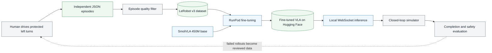

# SmolVLA for Autonomous Left Turns

This repository pairs a Three.js driving simulator with a focused vision-language-action policy. The current experiment has one job: follow a natural-language instruction and complete the protected left turn in the simulator.


The policy is fine-tuned from Hugging Face's open [`lerobot/smolvla_base`](https://huggingface.co/lerobot/smolvla_base) checkpoint. SmolVLA reads the front camera, vehicle state, and instruction, then produces a continuous chunk of throttle, brake, and steering actions. The implementation follows the official [LeRobot SmolVLA workflow](https://huggingface.co/docs/lerobot/smolvla).

## Current status

| Part | Status |
| --- | --- |
| Three.js driving simulator | Working |
| Automatic human episode saving | Working |
| Independent left-turn demonstrations | 156 collected |
| Clean demonstrations selected for training | 127 episodes, 14,060 frames |
| LeRobot v3 converter | Implemented |
| SmolVLA fine-tuning on RunPod | Ready, not launched from this revision |
| Held-out offline evaluation and plots | Implemented |
| Browser WebSocket inference | Implemented |
| Closed-loop checkpoint evaluation | Waiting for the new checkpoint |

The dataset size is reasonable for a first single-task fine-tune. LeRobot's SmolVLA guide suggests roughly 50 demonstrations as a starting point and warns that variation matters. This project has more demonstrations and 91 clean simulator seeds, but a successful training loss still does not guarantee stable closed-loop driving.

## Project flow



## Policy contract

Every training frame and live inference request uses the same fields:

```text
camera:       128 x 128 front RGB image
state:        [speed_mps, steering, previous_throttle, previous_brake]
instruction:  "Proceed through the city and make the protected left turn at the main intersection."
action:       [throttle, brake, steering]
rate:         10 Hz
```

The raw recorder stores speed normalized to the simulator's 24 m/s limit. The converter restores metres per second before writing `observation.state`; this keeps training aligned with the browser's live state. The model predicts 20 future actions and executes three before replanning from a new image.

Only the front camera is used. The bird's-eye image remains in the raw recording for inspection but is intentionally excluded from training because it is not an onboard sensor and the live policy should not depend on it.

## Dataset selection

The top-level `Dataset/` folder currently contains:

- 156 independent files named `human-*.json`
- 17,547 recorded frames
- 127 clean nominal episodes
- 29 episodes containing a collision or off-route event
- 57 old cumulative exports named `vla_urban_dataset_*.json`

The converter ignores all cumulative exports. By default it also excludes collision and off-route episodes from nominal imitation, checks the instruction and image shape, rejects exact duplicates, requires at least 60 frames, and requires route progress of at least 95%.
It places a seed-disjoint set of episodes in the final 10% of the dataset, matching LeRobot's holdout convention without leaking the same simulator seed into training and validation.

Inspect the selection without writing anything:

```bash
cd vla_training
python3 convert_dataset.py --dry-run
```

Create the LeRobot dataset and publish it:

```bash
python3 -m venv .venv
source .venv/bin/activate
python -m pip install --upgrade pip setuptools wheel
python -m pip install -e .

python convert_dataset.py \
  --overwrite \
  --push-to-hub \
  --repo-id Mayank022/urban-vla-left-turn-human
```

The generated dataset is written below `vla_training/data/`, which is ignored by Git. A `conversion_report.json` file records every accepted and rejected source episode.

## Run the simulator

Requirements are Node.js 22 or newer and a current Chrome or Chromium browser.

```bash
npm install
npm run dev
```

Open the URL printed by Vite, normally `http://localhost:5173`. Select the left-turn intent, click **Auto**, choose the `Dataset` folder once, and drive. A successful route saves one independent JSON episode and resets the simulator with the next seed.

## Fine-tune on RunPod

An RTX PRO 6000 with 96 GB VRAM is more than sufficient for the default batch size of 32. The vision encoder is unfrozen because simulated road imagery differs sharply from SmolVLA's robot-manipulation pretraining data.

On a fresh RunPod Pod:

```bash
cd /workspace
git clone https://github.com/Mayankpratapsingh022/Action_Chunking_Transformer_Autonomous_Driving.git
cd Action_Chunking_Transformer_Autonomous_Driving/vla_training

./scripts/setup_runpod.sh
printf '%s\n' 'HF_TOKEN=hf_your_write_token' > .env
./scripts/start_runpod_tmux.sh
```

Monitor it from the Pod:

```bash
tmux attach -t smolvla-left-turn
```

Or follow the persistent log from another shell:

```bash
tail -F /workspace/vla-driving/logs/smolvla-left-turn-v1-launcher.log
```

The default run uses 20,000 steps, a batch size of 32, a 10% episode-level validation split, validation every 1,000 steps, and checkpoints every 2,000 steps. Restarting the same command resumes from `checkpoints/last` automatically.

The final model is published to [`Mayank022/urban-vla-left-turn-smolvla`](https://huggingface.co/Mayank022/urban-vla-left-turn-smolvla). Training configuration, processor statistics, evaluation metrics, plots, and the full log are uploaded with it.

See [vla_training/README.md](vla_training/README.md) for dry runs, overrides, resume behavior, and artifact paths.

## Run the fine-tuned model

Create the Python environment once:

```bash
cd vla_training
python3 -m venv .venv
source .venv/bin/activate
python -m pip install -e .
python scripts/download_model.py
cd ..
```

Start inference in one terminal:

```bash
npm run inference -- --model-path vla_training/artifacts/smolvla-left-turn-v1
```

Start Vite in another:

```bash
npm run dev
```

Open the simulator and press `I`. The server uses CUDA when available, then Apple MPS, then CPU. It rejects instructions other than the protected left turn because this checkpoint is deliberately single-task.

The readiness endpoint is [`http://localhost:8000/health`](http://localhost:8000/health). With both services running, `npm run smoke:inference` checks the socket and one real prediction. `npm run eval:closed-loop` also requires the vehicle to move.

## Evaluation

The training run measures held-out flow-matching loss. After training, `evaluate.py` replays the held-out episodes through the final policy and saves:

- throttle, brake, and steering MAE and RMSE
- throttle and brake precision, recall, and F1
- steering-direction accuracy during active turns
- simultaneous throttle-and-brake rate
- per-episode error
- prediction scatter and action-trace plots

These are open-loop checks. The real acceptance test is closed-loop: route completion, collisions, off-route time, control smoothness, and repeated success on unseen seeds. A checkpoint should not be called good solely because its offline MAE is low.

## Repository structure

```text
.
|-- src/                         # Simulator, traffic, recorder, HUD, inference client
|-- scripts/                     # Simulator checks and dataset collection tools
|-- datasets/                    # Automated expert dataset workspace
|-- vla_training/
|   |-- configs/left_turn.json   # Fine-tuning defaults
|   |-- src/left_turn_vla/       # Conversion, commands, metrics, model adapter
|   |-- tests/                   # CPU tests without downloading model weights
|   |-- convert_dataset.py       # Human JSON to LeRobot v3
|   |-- train.py                 # Official LeRobot trainer wrapper
|   |-- evaluate.py              # Held-out action evaluation and plots
|   |-- inference_server.py      # Browser WebSocket server
|   `-- runpod_main.py           # RunPod entrypoint
|-- docs/images/
|-- DATASET_COLLECTION.md
`-- package.json
```

## Verification

```bash
npm run check
npm run smoke
npm run audit

cd vla_training
PYTHONPATH=src python -m pytest
python convert_dataset.py --dry-run
python train.py --dry-run
```

No GPU training is started by these commands.

## Safety

This is a synthetic simulator experiment. The vehicle dynamics, camera images, traffic, and demonstrations do not represent the range of conditions on public roads. Do not connect this policy to a real vehicle.
